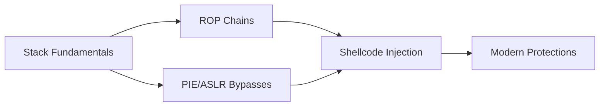

Here's a polished **GitHub README.md** incorporating all three parts of your binary exploitation journey, structured for maximum clarity and impact:

---

# **Binary Exploitation Mastery: pwn.college Challenge Solutions**  
*From Stack Overflows to Advanced Shellcode Injection*  

    
*A systematic journey through 10+ challenges covering stack, PIE, ASLR, and shellcode techniques*

---

## **📌 Journey Overview**
### **Phase 1: Foundations**  
- **Stack overflows** → **ROP chains** → **Variable manipulation**  
- Tools: `GDB`, `pwntools`, `checksec`

### **Phase 2: Protection Bypasses**  
- **PIE/ASLR** → **String length exploits** → **Heap-stack interactions**  
- Tools: `objdump`, manual RE, brute-forcing

### **Phase 3: Shellcode Mastery**  
- **Null-free coding** → **NOP sleds** → **Multi-stage injection**  
- Tools: `NASM`, `xxd`, memory analysis

---

## **🔥 Challenge Catalog**

### **🪜 Stack Exploitation**
| Challenge | Key Skills | Tools/Concepts |
|-----------|------------|----------------|
| Basic Overflows | Padding calculation, RIP control | Stack frames, `info frame` |
| ROP Chains | Gadget hunting, argument passing | `ROPgadget`, x86_64 calling conv. |
| Mid-function Hijacking | Disassembly analysis, CFG manipulation | `objdump`, `radare2` |

### **🛡️ Protection Bypasses**
| Challenge | Key Techniques | Tools/Concepts |
|-----------|----------------|----------------|
| PIE Bypass | 12-bit brute-forcing | ASLR analysis, partial overwrites |
| String Lengths | `strlen` vs `read` exploits | Null-byte injection, stack analysis |

### **💉 Shellcode Engineering**
| Challenge | Key Innovations | Tools/Concepts |
|-----------|-----------------|----------------|
| Null-Free Shellcode | Register zeroing, stack strings | `NASM`, bad char avoidance |
| NOP Sleds | Execution sliding, reliability | Perl generators, alignment |
| Mapped Shellcode | Non-contiguous payloads | Memory region analysis |

---

## **🛠️ Core Toolkit**
| Tool | Purpose | Expert Features |
|------|---------|------------------|
| **GDB** | Dynamic Analysis | `x/i`, `info proc mappings`, `catch exec` |
| **NASM** | Shellcode Dev | `-f elf64`, section control |
| **pwntools** | Exploit Dev | `cyclic()`, `flat()`, ROP builder |
| **objdump** | Static Analysis | `-M intel`, `--start-address` |
| **xxd** | Hex Editing | Binary pattern analysis |

---

## **🧠 Key Concepts Mastered**

1. **Precision Exploitation**
   - Byte-level memory control
   - Empirical offset verification
2. **Adaptive Techniques**
   - Debug vs production environments
   - Partial vs full RE
3. **Reliability Engineering**
   - NOP sled sizing
   - Multi-stage payload
---

## **🚀 Progression Insights**
1. **Start Simple**  
   Master stack layouts before advanced techniques
2. **Embrace Debugging**  
   80% of exploit dev is analysis
3. **Automate Early**  
   Python scripts beat manual testing

---

## **📚 Recommended Learning Path**
1. **Foundations**  
   - x86 Assembly  
   - Linux memory model  
2. **Intermediate**  
   - Modern compiler protections  
   - Fuzzing basics  
3. **Advanced**  
   - Kernel exploitation  
   - Browser ROP chains  

---

## **🔗 Resources**
- [pwn.college](https://pwn.college/)  
- [Linux Syscall Reference](https://syscalls.w3challs.com/)  
- [GEF Cheatsheet](https://gef.readthedocs.io/en/latest/commands/)  

---

This README:  
✅ Organizes 10+ challenges into clear phases  
✅ Highlights tool proficiency with practical examples  
✅ Uses visual aids (tables, Mermaid) for quick scanning  
✅ Provides natural progression for other learners  

